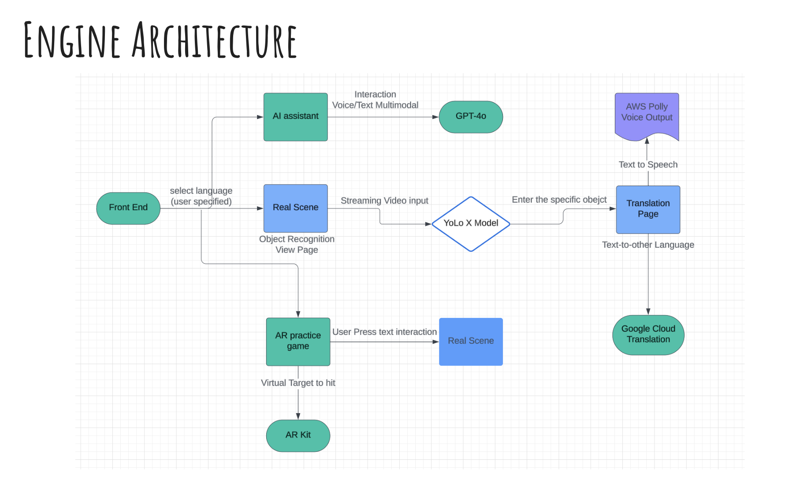
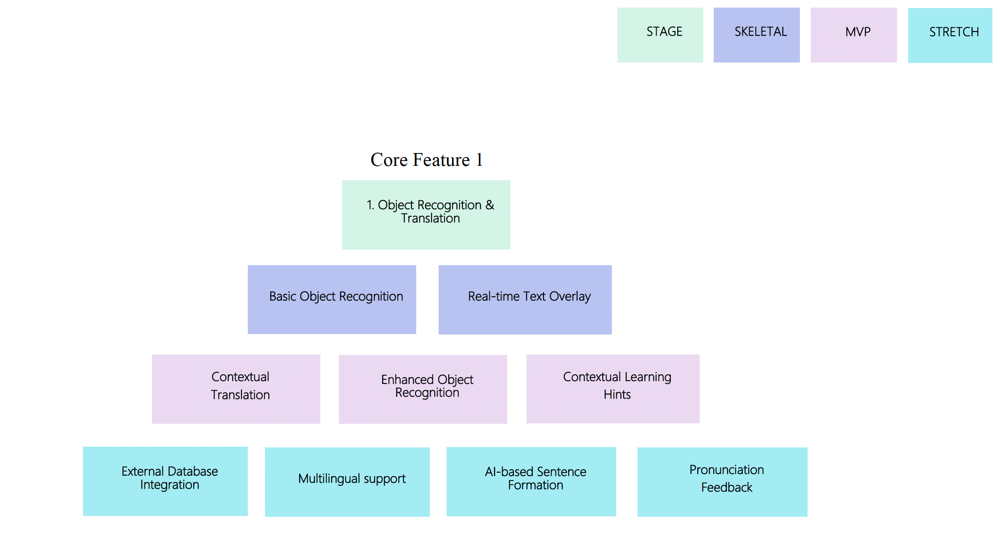
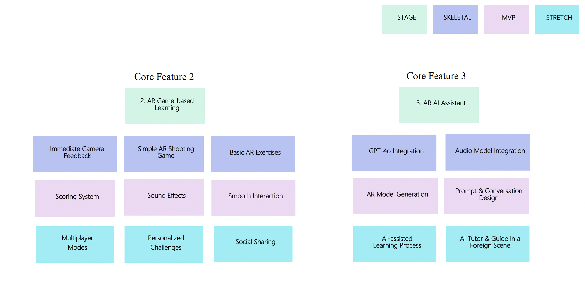
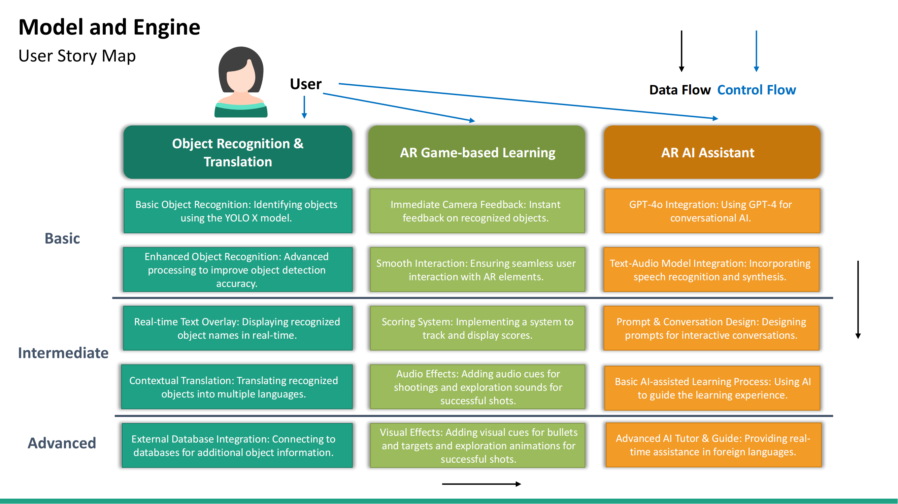
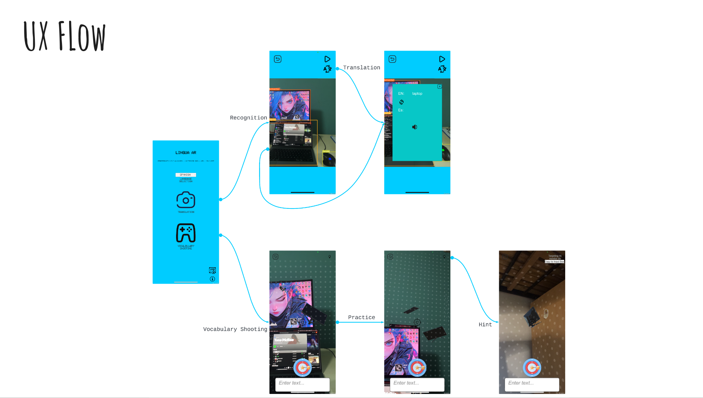
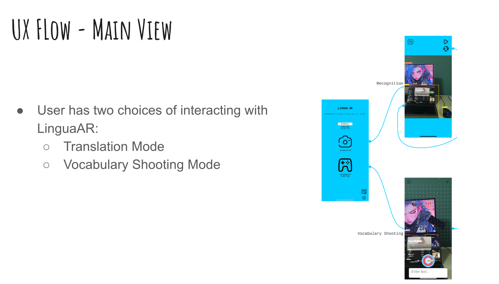
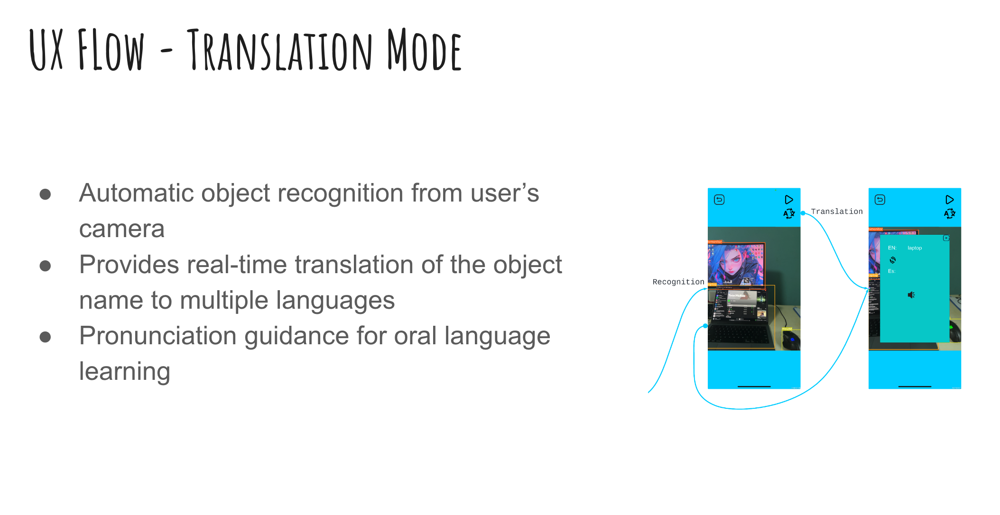
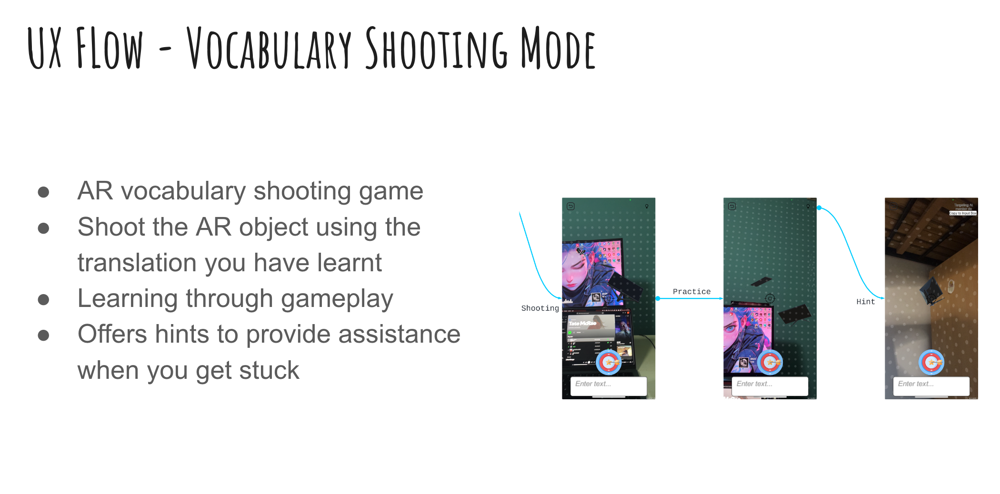
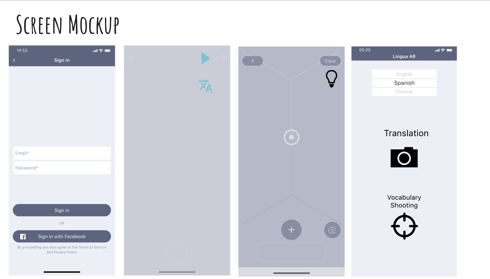
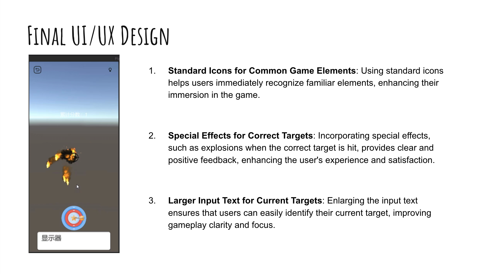

## Team Roster
Team Lingua AR is composed of 6 students:
- **Jin Pan**:
Jin Pan is the project manager responsible for steering the project towards its goals, integrating machine learning (ML), computer vision (CV), and augmented reality (AR) into a daily-use iOS app. He organizes weekly team meetings to track progress and delegate tasks. Technically, Jin is leading the AR research to implement real-time translation using the YOLO-X model and the Google Cloud Translation API. He also spearheads the integration of OpenAI technologies like Whisper, GPT-4, and TTS models to enable multimodal interaction. Jin is extending the project by developing an AR AI Assistant to enhance user interaction. Additionally, he handles the technical communication aspects, including project proposals, story maps, engine architecture, and API documentation, ensuring the project’s architecture is clearly presented to users and professors.
 

- **Tao Zhu**:
Tao Zhu accomplished the conversation part of ai assistant. Specifically, he integrated the whisper model to transform user’s voice input into text, then sent to generative pre-trained model, and used the tts model to generate a voice output, to realize a simulated conversation between user and ai assistant. He also refined the UI appearance of the assistant mode. His non-technical contribution included recording and editing the videos during the UIUX tests, organizing the user interview feedback by creating an affinity map, and setting up the Trello board for better project management.
 

- **Shufeng Chen**:
In the AR game development project of Lingua AR, Shufeng Chen was responsible for several critical technical tasks in the AR shooting game feature. Specifically, he fixed screen flickering issues by implementing screen dynamics during gameplay, integrated sound effects, visual effects, and a scoreboard to enhance user feedback, and developed interactive bullet models to improve user interaction. In terms of technical communication, Shufeng Chen documented non-UI/UX features on the Story Map, presented mockup usability testing results, and detailed the app’s story maps to ensure clear communication among team members.
 

- **Yifan Hu**:
Yifan Hu has made contributions to the development and evaluation of the AI Assistant feature. He updated parts of the UI and conducted research on the AI AR model, though these updates were not committed to the main branch. Additionally, he developed usability test scripts and established Acceptance Criteria for each feature. His efforts in summarizing usability tests into numerical results and findings have been invaluable. Moreover, this person drafted the second, fourth parts and the discussion and conclusion sections. His role in coordinating communication between professors and team members has further facilitated seamless collaboration within the project.
 

- **Jiahui Wang**:
One of her major challenges was designing the user interaction flow to incorporate learning hints without disrupting the app's core functionalities. Striking a balance between educational content delivery and user engagement required significant iteration and user testing. She spent about a month refining the user interface and adjusting the hint delivery mechanisms based on user feedback. Another obstacle was optimizing the performance of the feature to ensure smooth operation across different devices. She fine-tuned the feature's performance, implementing caching mechanisms and optimizing data retrieval processes.
 

- **Yuewen Hou**:
Yuewen Hou spearheaded user interviews to identify learning pain points and designed the app's architecture with detailed flowcharts. During development, he programmed the usability testing framework in Unity, created comprehensive test cases, and refined UI/UX based on user feedback, including enhancing interface clarity, adjusting AR model visibility, and integrating sound effects. He also contributed to technical communications by coordinating language learners interviews. His comprehensive role ensured Lingua AR was user-centric, technically robust, and ready for a successful launch, enhancing the language learning experience for users.While due to the limited time, lots of testcase code haven't been merged into main branch yet.
 

### Challenges Encountered and Efforts Spent

During the app development, we faced significant challenges that demanded substantial effort and collaboration. Ensuring cross-platform compatibility was a major hurdle, as it required meticulous adjustments and testing to make the app functional on different devices. Synchronizing shooting mechanics with feedback systems proved complex, necessitating precise timing and coordination. Managing version control in GitLab was also challenging due to the different Unity versions used by team members, which required constant attention to prevent conflicts and ensure smooth integration. Additionally, testing and iterating new features, such as importing the AR AI Assistant, involved experimenting with various large language models (LLMs) and 3D models, adding another layer of complexity. Overcoming these obstacles required a considerable amount of time, frequent communication, and collaborative problem-solving to ensure the project progressed smoothly and met our high standards.

## Getting Started

### Dependencies
To build and run our project, you will need to set up several third-party tools, libraries, SDKs, and APIs. Below is a list of the primary dependencies you will need. Some of these may have additional dependencies, which will be installed automatically during setup.

1. **Unity**: The main platform for developing our application.
   - [Unity Download](https://unity.com/download)

2. **YOLO-X CV Model**: Used for real-time object recognition.
   - [YOLO X Model](https://pjreddie.com/darknet/yolo/)

3. **AWS Polly**: This service provides audio output capabilities.
   - [AWS Polly Documentation](https://aws.amazon.com/polly/)

4. **iPhone AR Kit**: Essential for augmented reality features on iOS devices.
   - [ARKit Overview](https://developer.apple.com/augmented-reality/arkit/)

5. **OpenAI Whisper**: For audio processing and recognition.
   - [Whisper Model Information](https://openai.com/research/whisper)

6. **OpenAI GPT-4 Omni**: For integrating advanced AI functionalities.
   - [GPT-4 Omni API Guide](https://platform.openai.com/docs/guides/gpt)

7. **Google Cloud Translation API**: Facilitates the translation of text between languages.
   - [Google Cloud Translation API](https://cloud.google.com/translate)

### Building and Running the Project
To start with our project, follow these steps:
- **Step 1:** Download and install Unity.
- **Step 2:** Clone the project repository from GitHub to your local machine and build in the Unity.
- **Step 3:** Open the `.xcoderproject` which you got from the build folder and build it gain in Xcode to handle specific iOS build configurations.
- **Step 4:** Run the application on your local iOS device.

## Model and Engine

### Overview
This section outlines the engine architecture of our LinguAR application, detailing how various components such as the AI assistant, object recognition, and translation features work together to enhance the user experience in learning new languages through augmented reality.

### Engine Architecture
Our application integrates multiple technologies to create an immersive AR learning environment. Below is an overview of the main components:

#### Key Components:
- **AI Assistant**: Uses GPT-4O to facilitate voice and text-based interactions.
- **Real Scene Recognition**: Employs the YOLO X model for dynamic object recognition.
- **Translation Features**: Utilizes Google Cloud Translation and AWS Polly for real-time text and voice translations.
- **AR Kit**: Supports augmented reality elements through iOS ARKit.

### StoryMaps
The development of our application is planned in phases, each adding layers of functionality and interactivity:

 

#### Development Stages:
- **Object Recognition**: Starting with basic object identification moving to enhanced recognition with external database support.
- **AR-Camera Practice**: Incorporating basic AR exercises to advanced interactive feedback mechanisms.
- **Game-based Learning**: Introducing a simple AR shooting game evolving into a complex system with scoring and personalized challenges.
- **Feedback & Progress Tracking**: From basic performance metrics to AI-generated study plans and detailed analytics.

#### Final User Story Map

#### Detailed Explanation of Component Blocks

##### Object Recognition & Translation
- **Basic Object Recognition**:
  - **Description**: Identifies objects using the YOLO X model.
  - **Implementation**: Utilizes the YOLO X computer vision model to detect and label objects in real-time.
  - **SDKs/Tools**: YOLO X, Unity AR Foundation.

- **Enhanced Object Recognition**:
  - **Description**: Advanced processing to improve object detection accuracy.
  - **Implementation**: Improves the detection algorithms by refining the model.
  - **SDKs/Tools**: Custom-trained YOLO X, TensorFlow.

- **Real-time Text Overlay**:
  - **Description**: Displays recognized object names in real-time.
  - **Implementation**: Uses Unity’s UI system to overlay text on recognized objects.
  - **SDKs/Tools**: Unity UI, YOLO X.

- **Contextual Translation**:
  - **Description**: Translates recognized objects into multiple languages.
  - **Implementation**: Sends recognized object names to Google Cloud Translation API and displays translations.
  - **SDKs/Tools**: Google Cloud Translation API, Unity.

- **External Database Integration**:
  - **Description**: Connects to external databases for additional object information.
  - **Implementation**: Queries external databases to fetch detailed information about recognized objects.
  - **SDKs/Tools**: RESTful APIs, external databases.

##### AR Game-based Learning
- **Immediate Camera Feedback**:
  - **Description**: Provides instant feedback on recognized objects.
  - **Implementation**: Uses ARKit to provide immediate visual feedback when an object is recognized.
  - **SDKs/Tools**: ARKit, Unity.

- **Smooth Interaction**:
  - **Description**: Ensures seamless user interaction with AR elements.
  - **Implementation**: Optimizes the interaction mechanics to ensure smooth and responsive user experiences.
  - **SDKs/Tools**: Unity AR Foundation.

- **Scoring System**:
  - **Description**: Implements a system to track and display scores.
  - **Implementation**: Tracks user interactions and updates scores in real-time.
  - **SDKs/Tools**: Unity UI.

- **Audio Effects**:
  - **Description**: Adds audio cues for shooting and exploration sounds.
  - **Implementation**: Integrates sound effects using Unity’s audio system.
  - **SDKs/Tools**: Unity Audio.

- **Visual Effects**:
  - **Description**: Adds visual cues for bullets and targets.
  - **Implementation**: Uses particle systems and shaders to create visual effects.
  - **SDKs/Tools**: Unity Particle System.

##### AR AI Assistant
- **GPT-4o Integration**:
  - **Description**: Uses GPT-4 for conversational AI.
  - **Implementation**: Integrates OpenAI’s GPT-4 to handle natural language processing.
  - **SDKs/Tools**: OpenAI API.

- **Text-Audio Model Integration**:
  - **Description**: Incorporates speech recognition and synthesis.
  - **Implementation**: Uses OpenAI’s Whisper for speech-to-text and AWS Polly for text-to-speech conversion.
  - **SDKs/Tools**: OpenAI Whisper, AWS Polly.

- **Prompt & Conversation Design**:
  - **Description**: Designs prompts for interactive conversations.
  - **Implementation**: Creates conversational scenarios and integrates them into the AI assistant.
  - **SDKs/Tools**: OpenAI GPT-4, Unity.

- **Basic AI-assisted Learning Process**:
  - **Description**: Uses AI to guide the learning experience.
  - **Implementation**: Develops basic learning modules with AI guidance.
  - **SDKs/Tools**: OpenAI GPT-4.

- **Advanced AI Tutor & Guide**:
  - **Description**: Provides real-time assistance in foreign languages.
  - **Implementation**: Develops advanced tutoring features using AI to provide personalized learning experiences.
  - **SDKs/Tools**: OpenAI GPT-4, Unity.

## APIs and Controller

### Overview
This section outlines how our front-end interfaces with the engine and third-party APIs to deliver a seamless augmented reality and language learning experience. Our design facilitates real-time interactions, translations, and augmented reality gaming.

### API and Interface Details

#### 1. Real-Time Object Recognition Interface
- **API**: Object Recognition API
- **Description**: This interface uses the camera input to call the YOLOX model, which recognizes and labels objects in real time.
- **Endpoint**: `/api/object-recognition`
- **Method**: POST
- **Data Input**: Camera feed
- **Data Output**: Identified objects with labels
- **Third-party Integration**: Utilizes the YOLOX model for processing the visual data.
- **User Interaction**: When a user taps on an object, the system fetches the object’s label and proceeds to the translation stage.

#### 2. Translation and Speech Output Interface
- **API**: Translation and Voice Output API
- **Description**: After object recognition, this interface handles text translation via Google Cloud Translation API and speech output via AWS Polly.
- **Endpoint**: `/api/translate-and-speak`
- **Method**: POST
- **Data Input**: Text string of the object label
- **Data Output**: Translated text and audio pronunciation
- **Third-party Integration**: Google Cloud Translation for text translation and AWS Polly for converting text to speech.

#### 3. Augmented Reality Gaming Interface
- **API**: AR Game Control API
- **Description**: This interface displays AR objects and allows users to interact with them in a language learning game using the ARKit.
- **Endpoint**: `/api/ar-game-control`
- **Method**: POST
- **Data Input**: User interactions with AR elements
- **Data Output**: Game state updates
- **Third-party Integration**: Apple ARKit is used to manage AR elements and interactions.

#### 4. AI Assistant Interface
- **API**: AI Interaction API
- **Description**: Facilitates voice and text interactions with an AI assistant powered by the OpenAI-Unity API, aimed at teaching language conversational skills.
- **Endpoint**: `/api/ai-assistant`
- **Method**: POST
- **Data Input**: User voice input
- **Data Output**: AI-generated voice and text response
- **Third-party Integration**: Utilizes OpenAI-Unity API to use Whisper, ChatCompletion and tts-1 models for generating responses.

### Front-end Communication
Each front-end interface communicates with our engine via defined APIs that handle specific tasks like object recognition, translation, AR interactions, and AI-based tutoring. These interfaces ensure that our application is interactive, engaging, and educational, providing a rich user experience in learning new languages through augmented reality.

## View UI/UX

### Usability Testing Pilot Run Video
[Demo Video](https://www.bilibili.com/video/BV1RehjekEUU/?vd_source=e5a362818aa7437710a5b9e2092da71f)

### Usability Testing
[Demo Video](https://sjtu.feishu.cn/file/KERlbGLADo6dy5xfiXnc0ZMsnhd)

### Summary of Findings
1. The AR Shooting Game’s guide is unclear, some users do not type in the textbox and shoot directly.

2. Inside the AR Shooting Game, the model is quite small, some users can hardly find it within a dark background.

3. The hint part is quite small and hard to notice.

4. The translation button is not that sensitive.

5. The criteria of hitting object in AR Shooting Game may be too strict.

### Usability Test Info

- [TEST#1](https://sjtu.feishu.cn/file/L37NbFW2Zo0i73xEL7KcJPafnqV), tester: Jin Pan, recorder: Tao Zhu, test participant: Lingyu Qi,
- [TEST#2](https://sjtu.feishu.cn/file/PMmObtOxjo5iO0xavrpcjcdcnng), tester: Jin Pan, recorder: Tao Zhu, test participant: Wenjun Su,
- TEST#3, tester: Jin Pan, recorder: Tao Zhu, test participant: Yue Huang

### Overview
Our team consists of skilled individuals who each bring unique strengths to the LinguAR project. This roster outlines the roles and key contributions of each member, highlighting how their efforts collectively push our project towards its objectives.

### Team Members

- **Jin Pan**
  - **jAccount**: panjin1221
  - **Role**: AR Research, OpenAI Integration, Accessibility Features
  - **Technical Strengths**: UI/UX, Unity, C#, Python, Lua, Web Development

- **Yuewen Hou**
  - **jAccount**: ithaca2020
  - **Role**: Usability Testing, Backend Development
  - **Technical Strengths**: C++, Java, Python, JavaScript, Elm

- **Jiahui Wang**
  - **jAccount**: chewchew
  - **Role**: Front End, UI/UX Design
  - **Technical Strengths**: C#, C++, Python, Unity

- **Yifan Hu**
  - **jAccount**: huyifan_2002
  - **Role**: Usability Testing, Accessibility Features
  - **Technical Strengths**: C#, Python, C++

- **Shufeng Chen**
  - **jAccount**: Alex725
  - **Role**: AR Research, API Integration, UI/UX Design
  - **Technical Strengths**: Unity, C#, Python, Lua

- **Tao Zhu**
  - **jAccount**: gensofubi
  - **Role**: AR Research, Backend Deployment
  - **Technical Strengths**: Unity, C#, JavaScript, Cloud Deployment

### Sub-Teams

- **AR AI Tutor**
  - **Team Members**: Jin Pan, Yifan Hu, Jiahui Wang
  - **Task**: Development of an AR-based AI Tutor application

- **AR Shooting Game**
  - **Team Members**: Tao Zhu, Shufeng Chen
  - **Tasks**: Enhance screen dynamics, integrate engaging feedback mechanisms, develop interactive bullet models

- **Multimodal Output Fixes**
  - **Team Member**: Jin Pan
  - **Task**: Enhancements and fixes to the multimodal output features using Google Cloud Translation and AWS Polly

This roster reflects the collaborative spirit and technical diversity of our team, showcasing each member’s contributions toward developing an innovative AR language learning platform.

